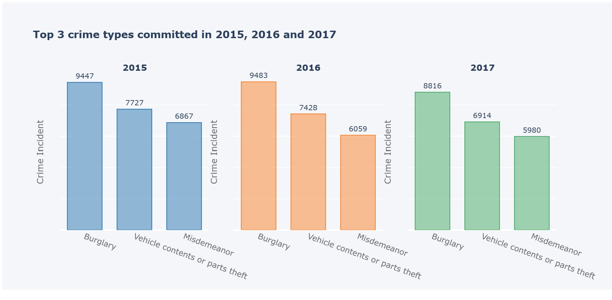
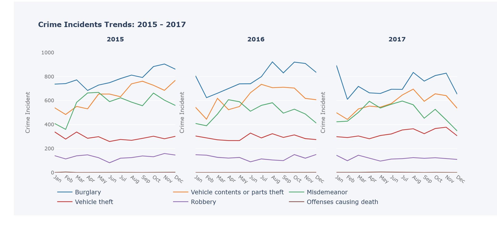
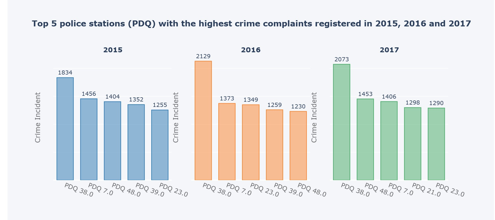

# Montreal Crime Data Analysis

In this project, I analyzed Montreal city crime data (2015 - 2017) with a goal of providing solutions to the key questions among other findings noted in the analysis like:

1. What are the top 3 prevalent crimes or offenses committed in 2015, 2016 and 2017 in Montreal City?
 
   
  
2. Which neighborhoods recorded the highest crime incidents in 2015, 2016 and 2017 and what are the crime types in these neighborhoods?
  

3. Which top 5 police stations (PDQ) got the most crime complaints in 2015, 2016 and 2017?
 

The Data Visualizations have been done using the Ploty library

(Graphs not visible in code due to large file size. To view the plotly graphs you can look at the pdf file uploaded)
